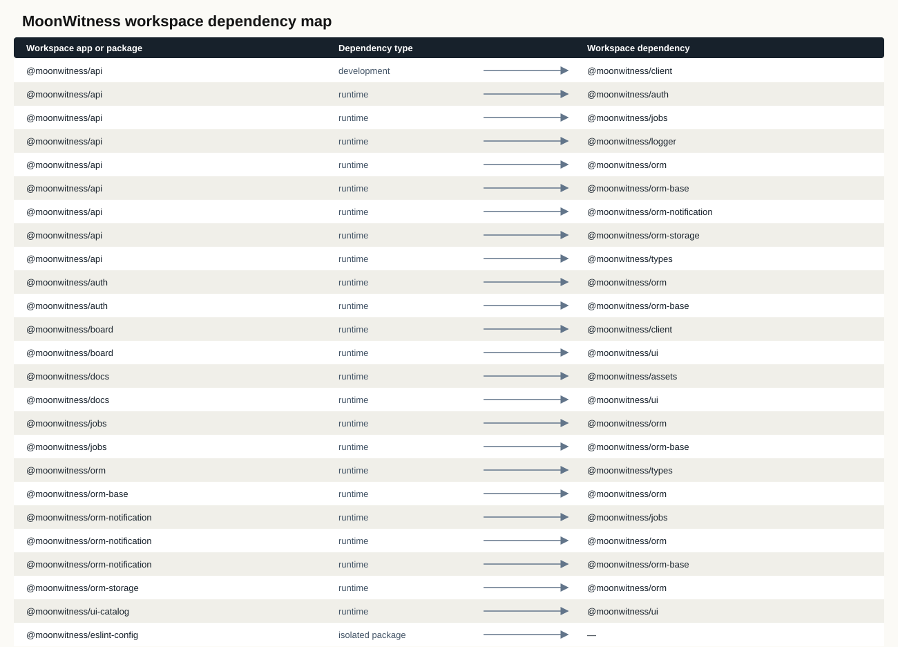
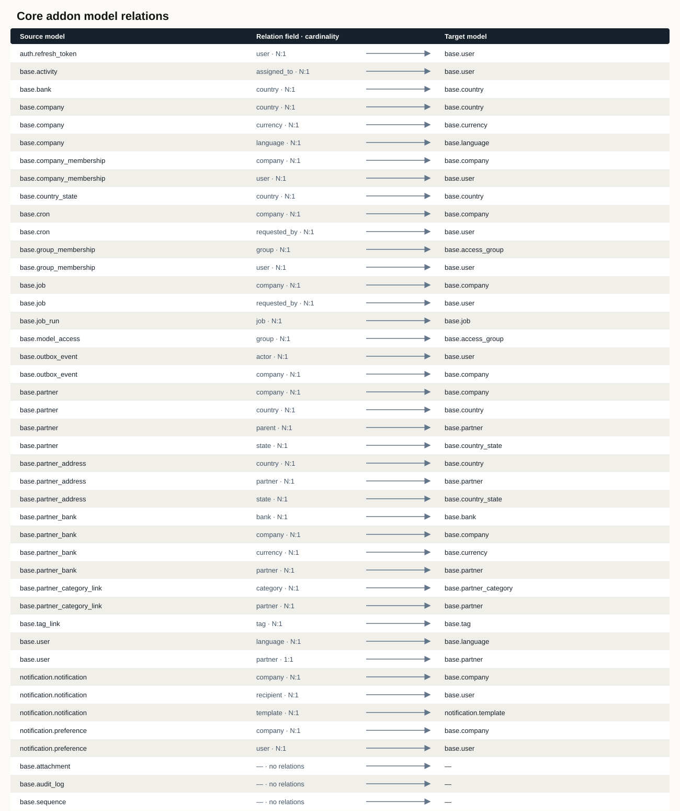
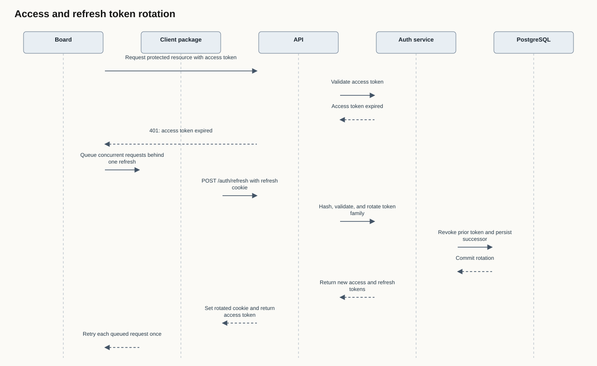
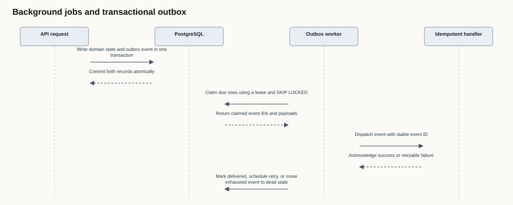
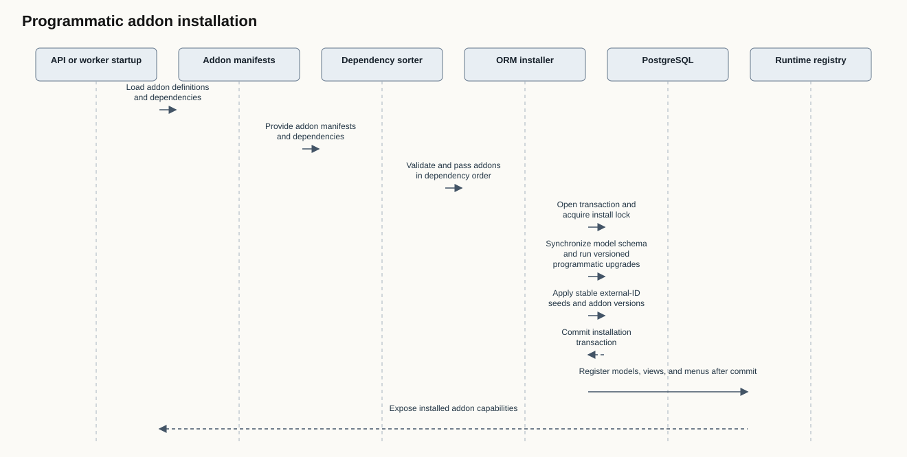
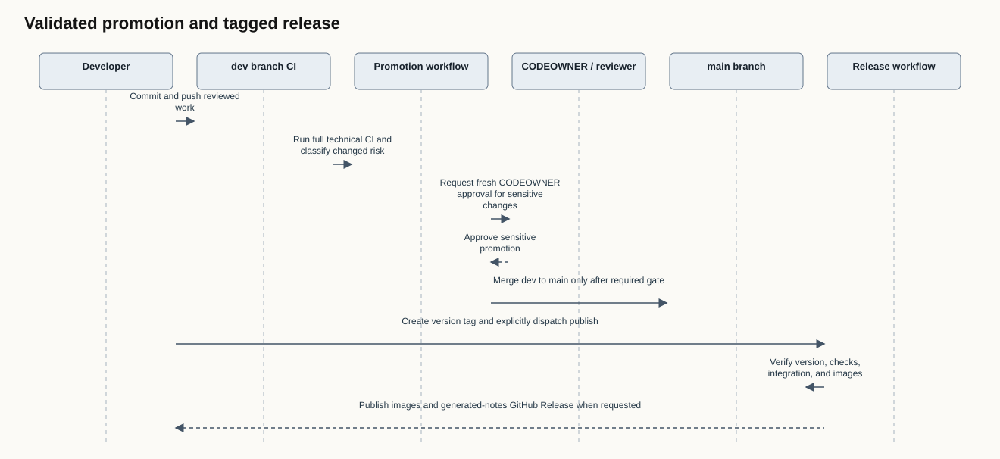

# Architecture diagrams

Generated exports in this directory are checked against repository metadata by
`pnpm architecture:check`. When a package manifest or core addon model field changes,
run `pnpm architecture:generate`, review the updated sources and exports, then
commit them with the implementation.

## Workspace and core addons

The package map includes internal runtime, peer, and development dependencies,
including packages with no internal edges. The core relation map is built from
the exported base, auth, jobs, and notification addon model declarations and
also lists models without relations; it contains model and field names only,
never seed record values.

| Diagram                                                | Editable source                       | Data export                                                   |
| ------------------------------------------------------ | ------------------------------------- | ------------------------------------------------------------- |
| [Workspace dependency map](workspace-dependencies.svg) | [Mermaid](workspace-dependencies.mmd) | [JSON with manifest source hash](workspace-dependencies.json) |
| [Core addon model relations](core-model-relations.svg) | [Mermaid](core-model-relations.mmd)   | [JSON with model source hash](core-model-relations.json)      |

## Curated runtime and delivery flows

These diagrams explain multi-package behavior that cannot be inferred from a
single manifest. Their editable source and SVG export are both generated from
[`scripts/architecture/flows.json`](../../../scripts/architecture/flows.json).
Keep each sequence aligned with the referenced implementation and workflow.

| Flow                                                            | Implementation references                                                                                                                                                                                 | Editable source                  |
| --------------------------------------------------------------- | --------------------------------------------------------------------------------------------------------------------------------------------------------------------------------------------------------- | -------------------------------- |
| [Access and refresh token rotation](auth-refresh.svg)           | [`packages/client/src/client.ts`](../../../packages/client/src/client.ts), [`apps/api/src/routes/auth.routes.ts`](../../../apps/api/src/routes/auth.routes.ts), [`packages/auth`](../../../packages/auth) | [Mermaid](auth-refresh.mmd)      |
| [Background jobs and transactional outbox](jobs-outbox.svg)     | [`packages/jobs`](../../../packages/jobs), [`packages/orm/src/environment.ts`](../../../packages/orm/src/environment.ts)                                                                                  | [Mermaid](jobs-outbox.mmd)       |
| [Programmatic addon installation](addon-install.svg)            | [`packages/orm/src/addon.ts`](../../../packages/orm/src/addon.ts), [`packages/orm-base/src/manifest.ts`](../../../packages/orm-base/src/manifest.ts)                                                      | [Mermaid](addon-install.mmd)     |
| [Validated promotion and tagged release](release-lifecycle.svg) | [`promote.yml`](../../../.github/workflows/promote.yml), [`release.yml`](../../../.github/workflows/release.yml)                                                                                          | [Mermaid](release-lifecycle.mmd) |

The release flow reflects current controls: promotion from `dev` to `main` is
gated by CI and sensitive changes require fresh CODEOWNER review; creating a
version tag runs verification, while publishing images and a GitHub Release
requires an explicit `workflow_dispatch` with `publish=true`.
