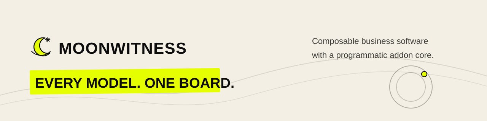

# Brand assets for documentation and GitHub Pages

`@moonwitness/assets` is the canonical source for the logo, wordmark, banner,
icons, and illustrations. The shared UI token source is
[`packages/ui/src/styles/tokens.css`](../../packages/ui/src/styles/tokens.css).
The root README embeds the banner directly from the asset package so it does not
maintain a second hand-edited copy.

The static documentation export copies every manifest-listed asset and the UI
token stylesheet into [`docs/assets/moonwitness`](../assets/moonwitness). Its
generated `asset-map.json` records each source file, public path, and SHA-256.
Use relative links to that directory from documentation pages: this preserves
the repository-name base path on GitHub Pages without hardcoded root URLs.

Regenerate after changing package assets or tokens with
`pnpm assets:export:docs`; CI runs `pnpm assets:check:docs` to reject missing,
stale, untracked, or modified exports. `pnpm assets:generate` also refreshes the
static export after regenerating brand sources.

The shared CSS token export is
[`tokens.css`](../assets/moonwitness/styles/tokens.css). The generated mapping
also contains the static brand/icon/illustration assets for the documentation
catalog. The interactive UI catalog is maintained at
[`apps/ui-catalog`](../../apps/ui-catalog) and consumes the same package API,
CSS and tokens. GitHub Pages has not been configured or published yet; the
portal and publishing workflow/repository settings remain M6.06/M6.07 work.
These milestones prepare reviewable static inputs and do not deploy the
application or site.
