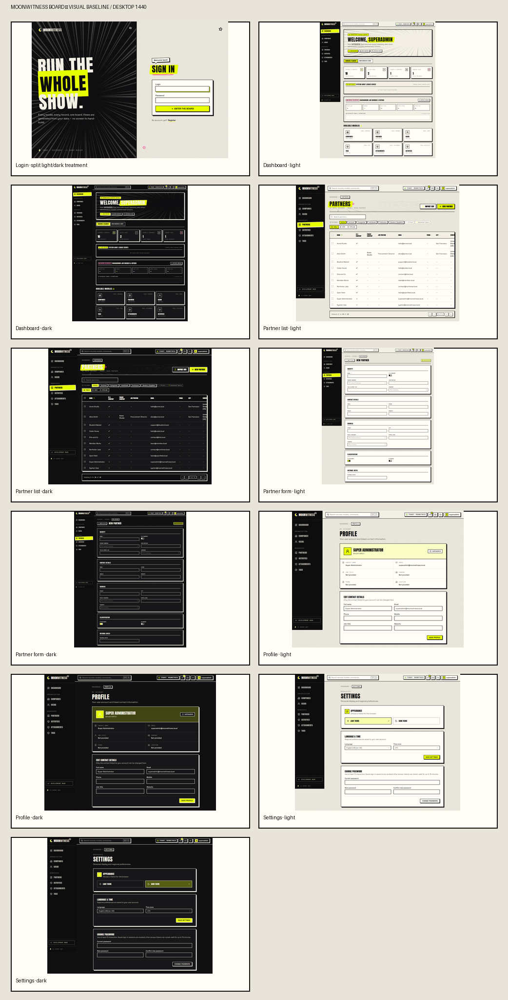

# MoonWitness Board visual direction

## Direction

Keep the existing MoonWitness identity and refine it into an **observatory field notebook**: lunar mark, inked editorial typography, paper surfaces, and a small luminous signal color. Manga speed lines and hand-drawn marks remain recognizable accents, used to establish focus or brand character. They should not become decoration on every surface. The interface should feel like a precise instrument for inspecting business records, rather than a comic page or a generic gradient SaaS dashboard.

The wordmark, crescent, and established light/dark pair are existing identity assets. M5.02–M5.07 should formalize and extend them, not replace them without a separately reviewed reason. Do not copy another product's logo or icon language.

## Measurable visual rules

| Area        | Direction                                                                                                                                                                                                                                                                                            |
| ----------- | ---------------------------------------------------------------------------------------------------------------------------------------------------------------------------------------------------------------------------------------------------------------------------------------------------- |
| Color       | Keep paper/ink as the neutral foundation. Lime is the primary action/focus signal; pink is a sparing alert accent. Define semantic info/success/warning/danger tokens in M5.03 and never use color as the only status cue.                                                                           |
| Themes      | Light and dark themes preserve the same meaning for every semantic token. The public login remains a deliberate split composition with a dark brand panel and paper form; it is not evidence of a missing authenticated-app theme.                                                                   |
| Type        | Anton is reserved for page titles, display moments, and short labels; Space Grotesk carries body and controls; JetBrains Mono is for compact metadata. Keep body copy in sentence case and use uppercase only where the short label benefits from it.                                                |
| Layout      | Use the tested 375 px mobile, 768 px tablet, and 1440 px desktop widths as design checkpoints. Avoid document-level horizontal overflow. Long values in a table must wrap, truncate with an accessible full-value affordance, or move to a detail view; they must not be clipped without indication. |
| Surfaces    | Use a clear page → section → control hierarchy. Heavy ink borders and offset shadows identify the selected or primary surface; avoid giving every nested block equal visual weight. Reserve one dominant highlight per action group.                                                                 |
| Iconography | Keep icons secondary to readable labels. M5.04 defines a consistent 24-unit SVG grid and stroke; M5.05 provides typed React wrappers. Doodles are decorative, hidden from assistive technology, and never carry meaning alone.                                                                       |
| Motion      | Motion directs attention, not decorates waiting. Respect `prefers-reduced-motion`; keep routine transitions short and never make essential information depend on animation.                                                                                                                          |
| Charts      | Choose an accessible semantic palette in M5.03. Pair color with labels, shapes, or patterns and provide a readable table alternative. Do not extract a chart package until more than one real consumer justifies it.                                                                                 |

The initial contrast target is WCAG 2.1 AA: 4.5:1 for ordinary text, 3:1 for large text and essential control boundaries/focus indicators. M5.03 must measure actual token pairs in both themes instead of treating a green or pink swatch as inherently accessible.

## Current component and asset inventory

Board currently has 29 reusable component files in four groups:

| Group       | Current source                     | Count | Role                                                                                                          |
| ----------- | ---------------------------------- | ----: | ------------------------------------------------------------------------------------------------------------- |
| Layout      | `apps/board/src/components/layout` |     5 | App shell, route protection, breadcrumbs, activity bell, scheduler panel.                                     |
| Brand/manga | `apps/board/src/components/manga`  |     3 | Crescent/wordmark logo, speed lines/doodles/underline, shortcut dialog.                                       |
| Primitives  | `apps/board/src/components/ui`     |    13 | Button, command, dialog, dropdown, input, label, popover, select, sheet, skeleton, switch, textarea, tooltip. |
| Data views  | `apps/board/src/components/views`  |     8 | List/form/field renderers, import, query builder, chatter, one-to-many and tags.                              |

`apps/board/src/index.css` is the only current visual token source. It defines paper/ink/lime/pink light and dark values, semantic aliases, Anton/Space Grotesk/JetBrains Mono stacks, hard-shadow utilities, halftone backgrounds, and reduced-motion behavior. Fonts are loaded from Google Fonts by `apps/board/index.html` with local generic fallbacks. Icons currently come from `lucide-react`; there is no `packages/assets` or `packages/ui` workspace package yet. The existing 29 files should be evaluated as migration inputs; do not duplicate a component just to satisfy a new package boundary.

## Visual audit

The baseline was captured from the running Board with synthetic E2E seed data. The full-page screenshots are generated under the ignored `test-results/visual-audit/` directory by `apps/board/e2e/visual-audit.spec.ts`; the curated desktop contact sheet is committed at [board-contact-sheet.png](assets/board-contact-sheet.png).

The Playwright audit covers login and protected dashboard, list, form, profile, and settings at 375×812, 768×1024, and 1440×1000. Protected pages are captured in both themes. The login is intentionally a split dark/paper brand composition. The run generated 33 screenshots, reported no document-level horizontal overflow, passed axe on login at all three sizes, and passed axe on protected desktop screens in both themes. Automated axe coverage does not currently include protected mobile/tablet screens.

### Findings to carry into implementation

- **Keep:** the crescent/wordmark, paper-and-ink foundation, lime primary action, restrained pink detail, responsive mobile record cards, and persistent theme parity. Together they are distinct from a stock admin template.
- **Refine hierarchy:** dashboard and detail pages use many equally heavy outlines and offset shadows. M5.03, M5.09, and M5.10 should reserve the strongest treatment for primary panels/actions and let supporting groups recede.
- **Fix in list migration:** the desktop partner list's country cells visibly clip values such as “United States” to a narrow edge column even though the page passes the horizontal-overflow assertion. M5.10/M5.14 should define a minimum table-column policy and an accessible wrap/truncate/detail behavior; the current overflow assertion alone does not catch cell clipping.
- **Tune density:** the desktop partner form is long but grouped into understandable sections. Preserve those groups and test long translated labels and narrow viewports before tightening fields or removing information.
- **Use decoration with intent:** speed lines and halftone communicate brand strongly on login/dashboard. Keep them as focal backgrounds and avoid combining them with several competing patterns on record-focused pages.
- **Track accessibility scope:** protected-page axe currently runs only at desktop. M5.17 should extend meaningful interaction/a11y checks to mobile/tablet and include keyboard/focus states for list, form, settings, and navigation.

## Migration guardrails

1. Extract assets and tokens from this baseline before migrating Board imports; maintain a single editable source for each logo/token.
2. Build reusable components from repeated behavior and visual structure, not from every one-off panel. Keep data fetching, router state, permissions, and `base.*` knowledge in Board/application code.
3. During M5.14 migration, compare the same seeded screens and viewport/theme matrix. Preserve current behavior and seeded data; fix documented visual/accessibility defects with specific regression assertions.
4. Treat screenshot differences as review evidence, not as an automatic acceptance test. Visual regression thresholds and intentional baseline changes belong in M5.17.
